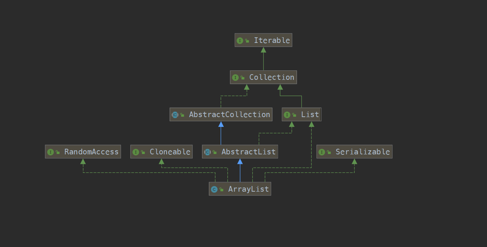
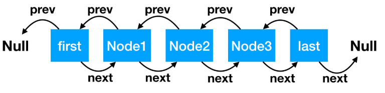
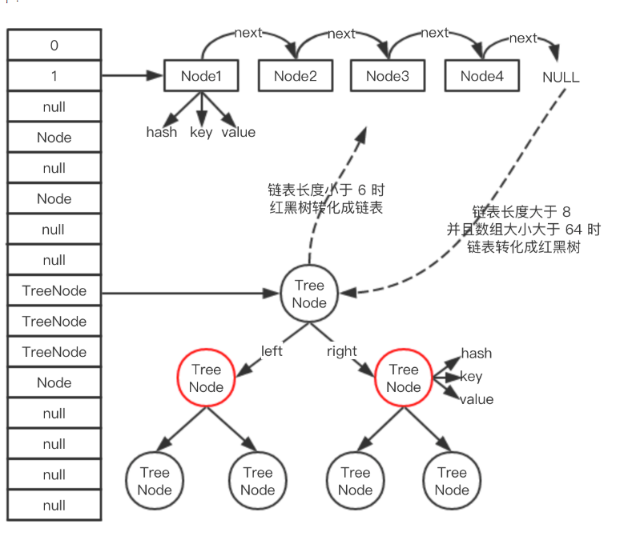

# Java 源码分析

## ArrayList 的源码解读




### 1. 整体架构

ArrayList的整体结构比较简单，就是一个数组的结构，其初始的默认数据大小为10， `DEFAULT_CAPACITY`,  为非线性安全的内容

类注释的内容

- 允许pull null， 并且会自动扩容
- size， isEmpty， get， set， add等方法的时间复杂度均为O（1）
- 是**非线性安全**的，多线程条件下，使用线程安全类： `Collections.synchronizedList`,
- 增强for循环，或者使用迭代器进行循环访问的时候，如果**数组的大小发生改变**，会快速失败，抛出异常

### 2. 源码解析

#### 2.1 初始化

三种方法初始化： **无参数直接初始化、指定大小初始化、指定初始化数据初始化**

```java
private static final Object[] DEFAULTCAPACITY_EMPTY_ELEMENTDATA = {};
// 无参数直接初始化，数组大小为空
public ArrayList(){
    this.elementData = DEFAULTCAPACITY_EMPTY_ELEMENTDATA;
}

// 指定初始数据初始化
public ArrayList(Collection<? extends E> c){
    // elementData 是保存数组的容器
    elementData = c.toArray();
    // 如果给定的集合数据有值
    if ((size == elementData) != 0){
        //如果数据集合的数据类型不是Object将会转换撑Object
        if (elementData.getClass() != Object[].class){
            elementData = Arrays.copyOf(elementData, size, Obejct[].class);
        }
    }else{
        //给定集合没有值， 则默认空数组
        this.elementData = EMPTY_ELEMENTDATA;
    }
}

```


补充：

1. ArrayList 无参构造器初始化时， 默认大小是**空数组**，10始在第一次add的时候扩容的值

#### 2.2 新增和扩容实现

新增就是往数组中添加元素，只要分成两步：

1. 判断是否需要扩容，如需要执行扩容操作
2. 直接赋值

对于ArrayList的扩容

- 扩容的规则不是翻倍，而是**1.5**倍
- ArrayList中的数组的最大值为Integer.MAX_VALUE, 超过值，JVM就不会给数组分配内存空间了
- 允许null值
- 扩容的语句 `Arrays.copyOf(elementData, newCapacity)`

#### ArrayList 为什么支持快速查询

ArrayList 底层继承RandomAccess接口，该接口，标识该数据结构可快速查询

## LinkedList

### 1. 整体架构

LinkedList  底层数据结构是一个**双向链表**，架构如下图所示：



链表中的元素叫做Node， Node节点的组成部分

```java
private static class Node<E> {
    E item;// 节点值
    Node<E> next; // 指向的下一个节点
    Node<E> prev; // 指向的前一个节点

    // 初始化参数顺序分别是：前一个节点、本身节点值、后一个节点
    Node(Node<E> prev, E element, Node<E> next) {
        this.item = element;
        this.next = next;
        this.prev = prev;
    }
}
```

### 2. 源码解析

#### 2.1 增加

增加节点时，有两种情况，默认在链表队尾增加，通过addFirst可以从头部增加

>  add的源码

```java
void linkLast(E e){
    // 把尾节点数据暂存
    final Node<E> l = last;
    // 新建新的节点，初始化入参含义：
    // l 是新节点的前一个节点，当前值是尾节点值
    // e 表示当前新增节点，当前新增节点后一个节点是 null
    final Node<E> newNode = new Node<>(l, e, null);
    // 新建节点追加到尾部
    last = newNode;
    //如果链表为空（l 是尾节点，尾节点为空，链表即空），头部和尾部是同一个节点，都是新建的节点
    if (l == null)
        first = newNode;!
    //否则把前尾节点的下一个节点，指向当前尾节点。
    else
        l.next = newNode;
    //大小和版本更改
    size++;
    modCount++;
}
```

> addFirst的源码分析

```java
// 从头部追加
private void linkFirst(E e) {
    // 头节点赋值给临时变量
    final Node<E> f = first;
    // 新建节点，前一个节点指向null，e 是新建节点，f 是新建节点的下一个节点，目前值是头节点的值
    final Node<E> newNode = new Node<>(null, e, f);
    // 新建节点成为头节点
    first = newNode;
    // 头节点为空，就是链表为空，头尾节点是一个节点
    if (f == null)
        last = newNode;
    //上一个头节点的前一个节点指向当前节点
    else
        f.prev = newNode;
    size++;
    modCount++;
}
```

#### 2.2 删除节点

> 删除节点的代码

```java
//从头删除节点 f 是链表头节点
private E unlinkFirst(Node<E> f) {
    // 拿出头节点的值，作为方法的返回值
    final E element = f.item;
    // 拿出头节点的下一个节点
    final Node<E> next = f.next;
    //帮助 GC 回收头节点
    f.item = null;
    f.next = null;
    // 头节点的下一个节点成为头节点
    first = next;
    //如果 next 为空，表明链表为空
    if (next == null)
        last = null;
    //链表不为空，头节点的前一个节点指向 null
    else
        next.prev = null;
    //修改链表大小和版本
    size--;
    modCount++;
    return element;
}
```

#### 节点查询

LinkedLIst通过使用**简单二分法**的方法进行节点的查询

> 查询

```java
// 根据链表索引位置查询节点
Node<E> node(int index) {
    // 如果 index 处于队列的前半部分，从头开始找，size >> 1 是 size 除以 2 的意思。
    if (index < (size >> 1)) {
        Node<E> x = first;
        // 直到 for 循环到 index 的前一个 node 停止
        for (int i = 0; i < index; i++)
            x = x.next;
        return x;
    } else {// 如果 index 处于队列的后半部分，从尾开始找
        Node<E> x = last;
        // 直到 for 循环到 index 的后一个 node 停止
        for (int i = size - 1; i > index; i--)
            x = x.prev;
        return x;
    }
}
```

#### 2.4 迭代器

因为LinkedList为双向链表，因此不能使用Iterator接口（Iterator只支持从头到尾的访问）**ListIterator**提供向前向后的迭代方法


PS 经典问题

**数组初始化，被加入一个值后，如果我使用 addAll 方法，一下子加入 15 个值，那么最终数组的大小是多少？**

答：数组在加入一个值后，实际大小是 1，最大可用大小是 10 ，现在需要一下子加入 15 个值，那我们期望数组的大小值就是 16，此时数组最大可用大小只有 10，明显不够，需要扩容，扩容后的大小是：10 + 10 ／2 = 15，这时候发现扩容后的大小仍然不到我们期望的值 16，这时候源码中有一种策略如下：

```java
// newCapacity 本次扩容的大小，minCapacity 我们期望的数组最小大小
// 如果扩容后的值 < 我们的期望值，我们的期望值就等于本次扩容的大小
if (newCapacity - minCapacity < 0)
    newCapacity = minCapacity;
```

所以最终数组扩容后的大小为 16。

## Hash

### 1. 整体架构

HashMap的底层数据结构主要是： 数组+链表+红黑树，当链表的长度大于等于8时，链表会转化成红黑树，当红黑树的大小小于等于6 时，红黑树会转化成链表，整体的数据结构如下：




### 2. 新增

新增key， value的步骤

1. 空数组有无初始化，没有的话初始化
2. 如果通过key的hash值能直接找到值，直接跳到6， 反之3
3. 如果hash冲突，解决办法： 链表或者红黑树
4. 链表： 递归循环，把新元素追加到队尾
5. 如果是红黑树，调用红黑树的新增方法
6. 再根据onlyIfAbsent判断是否需要覆盖
7. 判断是否需要扩容


```java
// 入参 hash：通过 hash 算法计算出来的值。
// 入参 onlyIfAbsent：false 表示即使 key 已经存在了，仍然会用新值覆盖原来的值，默认为 false
final V putVal(int hash, K key, V value, boolean onlyIfAbsent,
               boolean evict) {
    // n 表示数组的长度，i 为数组索引下标，p 为 i 下标位置的 Node 值
    Node<K,V>[] tab; Node<K,V> p; int n, i;
    //如果数组为空，使用 resize 方法初始化
    if ((tab = table) == null || (n = tab.length) == 0)
        n = (tab = resize()).length;
    // 如果当前索引位置是空的，直接生成新的节点在当前索引位置上
    if ((p = tab[i = (n - 1) & hash]) == null)
        tab[i] = newNode(hash, key, value, null);
    // 如果当前索引位置有值的处理方法，即我们常说的如何解决 hash 冲突
    else {
        // e 当前节点的临时变量
        Node<K,V> e; K k;
        // 如果 key 的 hash 和值都相等，直接把当前下标位置的 Node 值赋值给临时变量
        if (p.hash == hash &&
            ((k = p.key) == key || (key != null && key.equals(k))))
            e = p;
        // 如果是红黑树，使用红黑树的方式新增
        else if (p instanceof TreeNode)
            e = ((TreeNode<K,V>)p).putTreeVal(this, tab, hash, key, value);
        // 是个链表，把新节点放到链表的尾端
        else {
            // 自旋
            for (int binCount = 0; ; ++binCount) {
                // e = p.next 表示从头开始，遍历链表
                // p.next == null 表明 p 是链表的尾节点
                if ((e = p.next) == null) {
                    // 把新节点放到链表的尾部 
                    p.next = newNode(hash, key, value, null);
                    // 当链表的长度大于等于 8 时，链表转红黑树
                    if (binCount >= TREEIFY_THRESHOLD - 1)
                        treeifyBin(tab, hash);
                    break;
                }
                // 链表遍历过程中，发现有元素和新增的元素相等，结束循环
                if (e.hash == hash &&
                    ((k = e.key) == key || (key != null && key.equals(k))))
                    break;
                //更改循环的当前元素，使 p 在遍历过程中，一直往后移动。
                p = e;
            }
        }
        // 说明新节点的新增位置已经找到了
        if (e != null) {
            V oldValue = e.value;
            // 当 onlyIfAbsent 为 false 时，才会覆盖值 
            if (!onlyIfAbsent || oldValue == null)
                e.value = value;
            afterNodeAccess(e);
            // 返回老值
            return oldValue;
        }
    }
    // 记录 HashMap 的数据结构发生了变化
    ++modCount;
    //如果 HashMap 的实际大小大于扩容的门槛，开始扩容
    if (++size > threshold)
        resize();
    afterNodeInsertion(evict);
    return null;
}
```

#### 2.1 红黑树新增节点过程

1. 首先判断新增节点是否在红黑树上已经存在，判断手段主要如下：
   1. 如果节点没有自己实现Comparable接口，使用equals进行判断
   2. 如果自己实现了该接口，使用CompareTo进行判断
2. 新增的节点如果已经存在，直接返回，如果不存在，判断新增节点是在当前节点的左边还是右边
3. 进行自旋递归，知道当前节点的左边或者右边的节点为空时，停止自旋，当前节点即为我们新增节点的父结点
4. 将新增节点放到当前节点的左边或者右边的节点为空的地方，并于当前节点建立父子节点的关系
5. 进行着色和旋转

红黑树的五个原则：

- 节点是红色或黑色
- 根是黑色
- 所有叶子都是黑色
- 从任一节点到其每个叶子的所有简单路径都包含相同数目的黑色节点
- 从每个叶子到根的所有路径上不能有两个连续的红色节点

