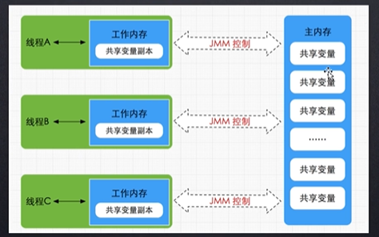

# Java虚拟机内存管理

## Java 内存模型

Java 内存原子操作：

- read(读取) : 从主内存读取数据
- load（载入）：将主内存读取到的数据写入工作内存当中
- use（使用）：从工作内存中读取数据来计算
- assign（赋值）：将计算好的值重新赋值到工作内存当中
- store（存储）：将工作内存数据写入主内存
- write（写入）：将store过去的变量赋值给主内存中的变量
- lock（锁定）： 将主内存变量加锁， 标识为线程独占状态
- unlock（解锁）：将主内存变量解锁， 解锁后其他线程可以锁定该变量