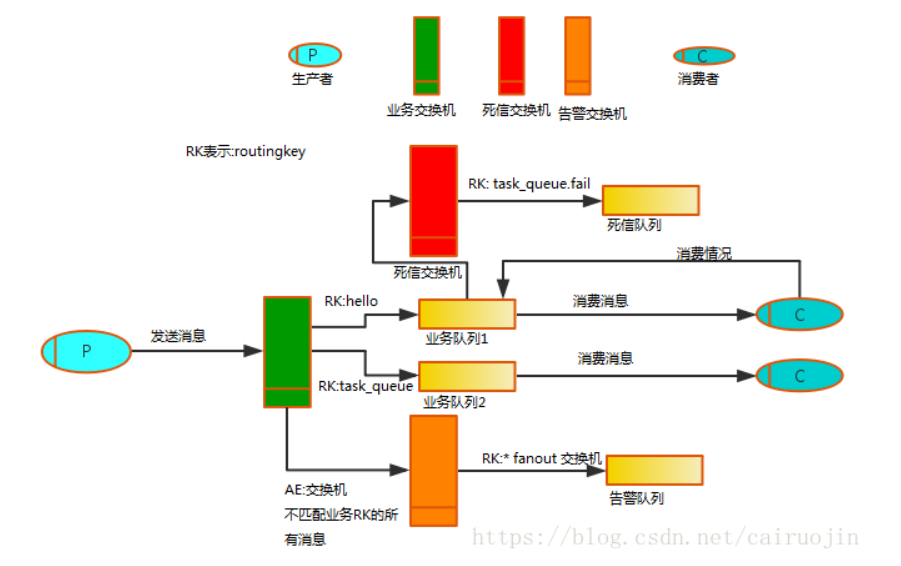

# RabbitMQ的学习内容

## 什么是消息队列

消息队列是互联网当中较为常见的一种解耦的技术

什么时候不适用消息队列： 上游实时关注执行结果

什么时候适用消息队列：

1. 数据驱动的任务依赖，多个任务需要轮流执行，轮流订阅上一个任务
2. 上游不关注多下游的执行结果，上游执行结束后发送到MQ， 夺下有订阅MQ
3. 异步返回执行时间长

死信队列多了一个过期的己置，到期后会自动去尝试消费，通过死信交换机做匹配，选择想要的消费失败队列。

消息中间件是在消息传输过程中保存消息的容器。队列的主要目的是提供路由并保证消息的转递。

### 特点

1. 异步处理的模式
2. 多个应用程序调用关系为松耦合

### 传递模式

1. 点到点模型PTP

   每个消息只用一个消费者， 发送者和消费者之间没有时间依赖， 接收者确认消息接受和处理成功

2. 发布-订阅模型Pub/Sub

   一对多关系，通过订阅主题，发布者建立一个订阅，订阅者保持持续的活动状态已接受消息。

   每个消息可以有多个订阅者

   客户端只有订阅后才能接收到消息，有时间依赖

   持久订阅 订阅关系建立后，消息不会消失，不管订阅者是否都在线

   非持久订阅 订阅这为了接受消息， 必须一直在线

### 典型的应用案例

1. 注册时发送邮件或者短信
2. 日志分析使用，多个服务产升的数据发送到中间件发送到分析服务器
3. 消息复制， 用于跨机房数据传输、搜索、离线数据计算等
4. 延迟消息发送和暂存，可以把中间件当程可靠的消息暂存地。接受消息，暂时先不发送

## Java操作消息队列

