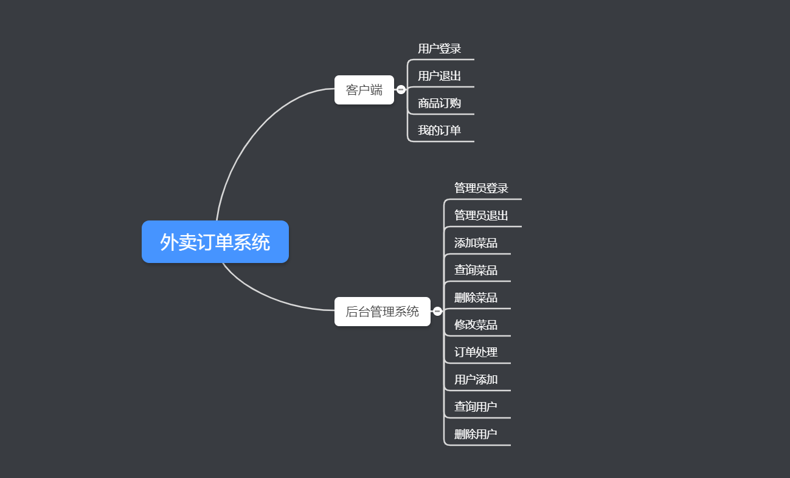
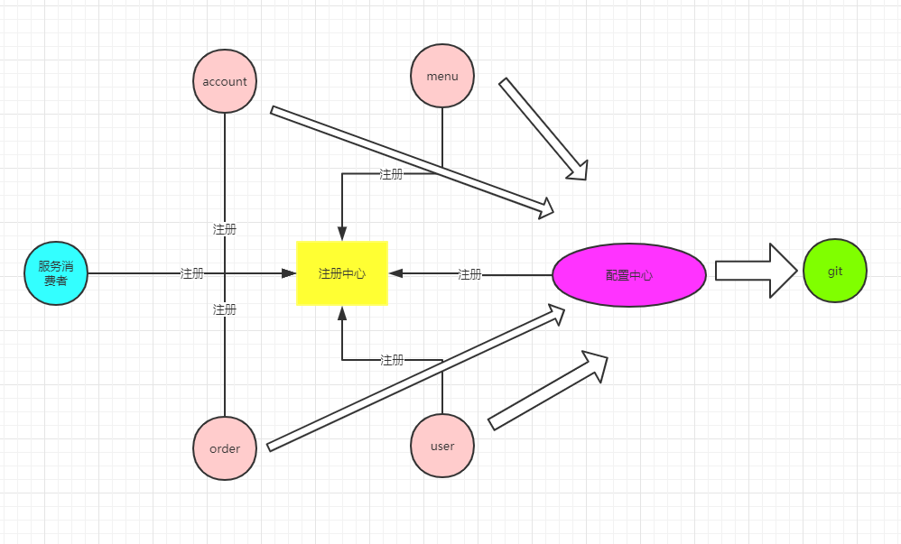
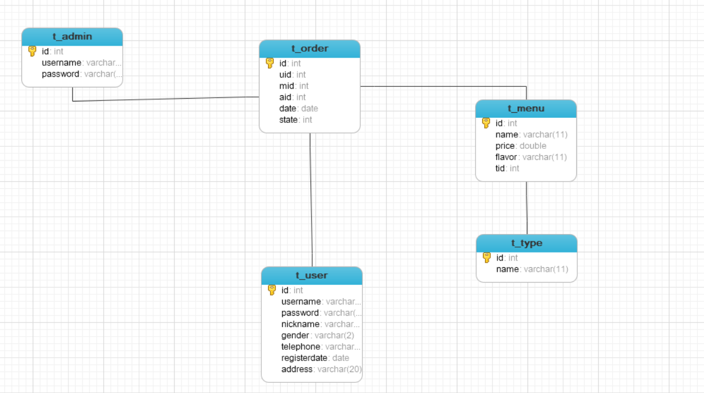

# 外卖订单系统

## 项目需求

### 客户端

功能： 针对普通用户， 用户登录，用户退出，菜品订购， 我的订单

### 后台管理系统

后台管理系统： 管理员登录， 管理员退出，添加菜品，查询菜品， 修改菜品，删除菜品，订单处理，添加用户，查询用户，  删除用户



### 业务拆分

account 提供账户服务： 用户和管理员的登录退出

menu 提供菜品服务： 添加菜品， 删除菜品， 修改菜品，查询菜品

order 提供订单服务： 添加订单， 查询订单， 删除订单，处理订单

user 提供用户服务： 添加用户， 查询用户，删除用户

分理处一个服务消费者，调用以上四个服务提供者， 服务消费者包含了客户端的前端页面和后台接口， 用户和管理员访问的资源都保存在服务消费者中，服务消费者根据具体的浮球调用四个服务者的业务逻辑， 通过Fegin实现负载均衡

 四个服务提供者和一个服务消费者都需要在注册中心进行注册， 同事可以使用配置中心来对配置文件进行统一的管理




## 项目创建

### 创建父项目

```xml
<?xml version="1.0" encoding="UTF-8"?>
<project xmlns="http://maven.apache.org/POM/4.0.0" xmlns:xsi="http://www.w3.org/2001/XMLSchema-instance"
         xsi:schemaLocation="http://maven.apache.org/POM/4.0.0 https://maven.apache.org/xsd/maven-4.0.0.xsd">
    <modelVersion>4.0.0</modelVersion>
    <packaging>pom</packaging>
    <modules>
        <module>eurekaserver</module>
        <module>configserver</module>
        <module>order</module>
    </modules>
    <parent>
        <groupId>org.springframework.boot</groupId>
        <artifactId>spring-boot-starter-parent</artifactId>
        <version>2.0.7.RELEASE</version>
        <relativePath/> <!-- lookup parent from repository -->
    </parent>
    <groupId>com.microservice</groupId>
    <artifactId>foodorder</artifactId>
    <version>0.0.1-SNAPSHOT</version>
    <name>foodorder</name>
    <description>Demo project for Spring Boot</description>

    <properties>
        <java.version>1.8</java.version>
    </properties>

    <dependencies>
        <dependency>
            <groupId>org.springframework.boot</groupId>
            <artifactId>spring-boot-starter-web</artifactId>
        </dependency>

        <dependency>
            <groupId>javax.xml.bind</groupId>
            <artifactId>jaxb-api</artifactId>
            <version>2.3.0</version>
        </dependency>
        <dependency>
            <groupId>com.sun.xml.bind</groupId>
            <artifactId>jaxb-impl</artifactId>
            <version>2.3.0</version>
        </dependency>
        <dependency>
            <groupId>com.sun.xml.bind</groupId>
            <artifactId>jaxb-core</artifactId>
            <version>2.3.0</version>
        </dependency>

        <dependency>
            <groupId>javax.activation</groupId>
            <artifactId>activation</artifactId>
            <version>1.1.1</version>
        </dependency>

        <dependency>
            <groupId>org.projectlombok</groupId>
            <artifactId>lombok</artifactId>
            <optional>true</optional>
        </dependency>
    </dependencies>

    <!-- 引入Spring Cloud依赖，管理Spring Cloud生态各个组件 -->
    <dependencyManagement>
        <dependencies>
            <dependency>
                <groupId>org.springframework.cloud</groupId>
                <artifactId>spring-cloud-dependencies</artifactId>
                <version>Finchley.SR2</version>
                <type>pom</type>
                <scope>import</scope>
            </dependency>
        </dependencies>
    </dependencyManagement>

</project>


```

### 注册中心模块

- pom.xml

```xml
<dependencies>
    <dependency>
        <groupId>org.springframework.cloud</groupId>
        <artifactId>spring-cloud-starter-netflix-eureka-server</artifactId>
    </dependency>
</dependencies>
```

- application.yml

```yaml
server:
  port: 8761
#配置中心
eureka:
  client:
    service-url:
      defaultZone: http://localhost:8761/eureka
#    是否注册自己
    register-with-eureka: false
#    是否导入其他的配置
    fetch-registry: false
```

- 启动类

```Java
@SpringBootApplication
@EnableEurekaServer
public class EurekaServerApplication {
    public static void main(String[] args) {
        SpringApplication.run(EurekaServerApplication.class, args);
    }
}
```

### 配置中心模块

- pom.xml

```xml
<dependencies>
    <dependency>
        <groupId>org.springframework.cloud</groupId>
        <artifactId>spring-cloud-config-server</artifactId>
    </dependency>
</dependencies>
```

- application.yml

```yaml
server:
   port: 8762
spring:
  application:
    name: configserver
#    本地配置
  profiles:
    active: native
  cloud:
    config:
      server:
        native:
          searcg-location: classpath:/shared
```

- ConfigServerApplication

```java 
@SpringBootApplication
@EnableConfidServer
public class ConfigServerApplication {
    public static void main(String[] args) {
        SpringApplication.run(ConfigServerApplication.class, args);
    }
}
```

### 服务提供者 order

- pom.xml

```xml
<dependencies>
    <dependency>
        <groupId>org.springframework.cloud</groupId>
        <artifactId>spring-cloud-starter-netflix-eureka-client</artifactId>
        <version>2.0.2.RELEASE</version>
    </dependency>

    <dependency>
        <groupId>org.springframework.cloud</groupId>
        <artifactId>spring-cloud-starter-config</artifactId>
        <version>2.0.2.RELEASE</version>
    </dependency>
</dependencies>
```

- bootstrap.yml

```yaml
spring:
  application:
    name: order
  profiles:
    active: dev
  cloud:
    config:
      uri: http://localhost:8762
      fail-fast: true
```

- Handler

```java
package com.southwind.controller;

import org.springframework.beans.factory.annotation.Value;
import org.springframework.web.bind.annotation.GetMapping;
import org.springframework.web.bind.annotation.RequestMapping;
import org.springframework.web.bind.annotation.RestController;

/**
 * @author: JamesZhan
 * @create: 2019 - 10 - 29 0:19
 */
@RestController
@RequestMapping("/order")
public class OrderHandler {

    @Value("${server.port}")
    private String port;

    @GetMapping("/index")
    public String index(){
        return "order的端口是：" + this.port;
    }
}
```


application.java

```java
package com.southwind;

import org.springframework.boot.SpringApplication;
import org.springframework.boot.autoconfigure.SpringBootApplication;

/**
 * @author: JamesZhan
 * @create: 2019 - 10 - 29 0:19
 */
@SpringBootApplication

public class OrderApplication {
    public static void main(String[] args) {
        SpringApplication.run(OrderApplication.class, args);
    }
}
```


## 项目内容

### 数据库表结构



