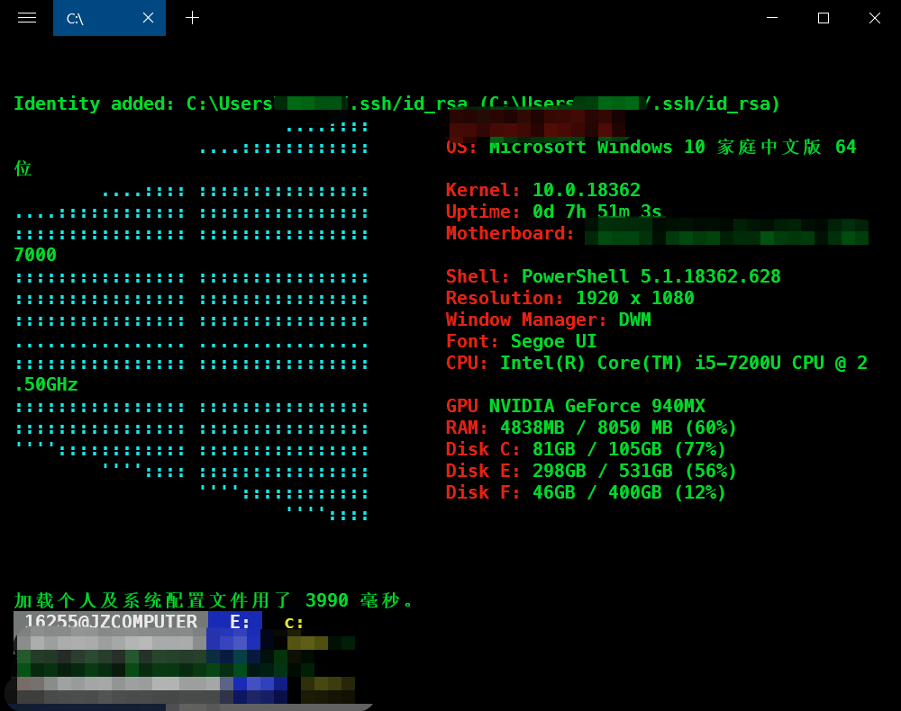

# 美化PowerShell 

## 参考文章

https://blog.csdn.net/yihuajack/article/details/104565634

## 首先展示效果图




 	


## 实现步骤

### 1.安装Fluent Terminal

### 2. 管理者模式打开powershell， 执行如下命令

```shell
Set-ExecutionPolicy -ExecutionPolicy ByPass
```


### 3. 安装posh-git 和 oh-my-posh

```shell
Install-Module DirColors
Install-Module windows-screenfetch
```

如果遇到选项直接选择Yes

### 4. 配置PowerShell_profile.ps1文件

在 C:/Users/<Username>/Documents/WindowsPowerShell 中新建PowerShell_profile.ps1文件

从[PowerLine](https://github.com/seebi/dircolors-solarized) 中下载，解压之后选择需要的主题，将其直接放在C:/Users/<Username>目录下，之后在上述创建的文件中添加如下内容

```shell
Import-Module DirColors
Update-DirColors ~/dircolors.256dark
Import-Module posh-git
if (!(Get-SshAgent)) {
    Start-SshAgent
}
Import-Module oh-my-posh
Set-Theme PowerLine
Screenfetch
```

此使打开Fluent PowerShell效果如上图所示。